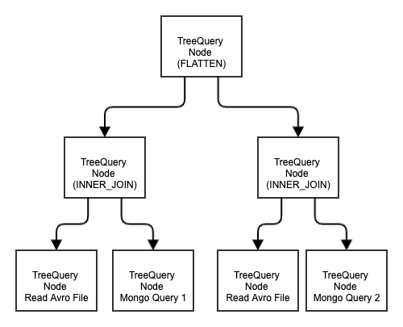

#System Design Document - Tree Query

##Objective
An asynchronous distributed batch query system distributes data query and joining of data from different source in n-ary tree compute nodes.<br>

Leaf node queries from different sources:<br>
1. Avro file
2. SQL
3. Mongo
4. Redis
5. Kafka (batch)
After leaf node finishing query, it return output as Avro entries into 
1. Avro Flat File (network folder/AWS S3/GCP Cloud Storage)
2. Redis (distributed MEM cache)
for parent node to process.

Parent node applies batch streaming framework such as Apache beam to join the data.
Each node output results into Avro Flat File/Redis for upper level of node calculation until reaching root node. 

In the end, client receives result from root node after all node computation finish.

##Algorithm
Simple Depth First Search of the tree.
Time Complexity : O(N)
Travse each node for query and joining.

Space Complexity: O(kN), where k is the level of tree
Buffer storage of query result, intermediate join result.

##High Level architecture design



Each node is stateless with identical code.
A json file describes the tree schema.
The request to the root node carries this json file.

##Json file describing tree schema

```Json

{
  "description": "Query both 5Y and 10Y bond trade",
  "action": "FLATTEN",
  "elements": [
    {
      "description": "Joinning bond trades and Bond security set with 5Y tenor",
      "action": "INNER_JOIN",
       "elements":[{
            "description": "Load Bond Trades",
            "action": "LOAD",
            "source" : "gs://dexbigdata-bondtrade/bondtrade1.avro",
            "avro_schema": {"name":"BondTrade","type":"record","namespace":"io.exp.security.model.avro","fields":[{"name":"id","type":"string"},{"name":"cust","type":"string"},{"name":"tradeDate","type":"string"},{"name":"tradeType","type":"string"},{"name":"timestamp","type":"long","logicalType":"time-millis"},{"name":"asset","type":{"name":"Asset","type":"record","fields":[{"name":"securityId","type":"string"},{"name":"notional","type":"double"},{"name":"price","type":"double"},{"name":"currency","type":"string"},{"name":"bidask","type":{"name":"BidAsk","type":"enum","symbols":["BID","ASK"]}}]}}]}
          },
          {
            "description": "Query Mongo Security",
            "action": "QUERY":
            "queryType" : "MONGO",
            "source" : "localmongo",
            "database" : "hkma",
            "collection": "OutstandingGovBond",
            "query" : "{}",
            "avro_schema": {"name":"BondStatic","type":"record","namespace":"io.exp.security.model.avro","fields":[{"name":"expected_maturity_date","type":"string"},{"name":"original_maturity","type":"string"},{"name":"issue_number","type":"string"},{"name":"isin_code","type":"string"},{"name":"stock_code","type":"string"},{"name":"coupon","type":"double"},{"name":"outstanding_size","type":"double"},{"name":"institutional_retail","type":"string"},{"name":"fixfloat","type":{"name":"FixFloat","type":"enum","symbols":["FIX","FLOAT"]}}]}
          }
      ],
      "keys": [{"0": "asset.securityId","1": "isin_code"}]
    }
  ]
}


```

## Performance optimization
Caching the intermediate/hash result into flat file/Redis with a key hashed from the node
To be further elaborated.

##Potential Usage
Big Query application sourcing data from different sources in different locations
